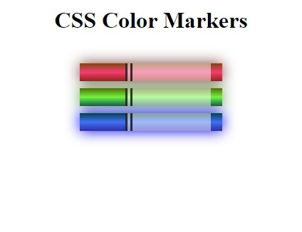

# Color markers

> 3 Markers :-
>
> - Red
> - Green
> - Blue
>
> Color Format used are
>
> - Rgb
> - Rgba
> - Hexadecimal notation
> - hsl
>
> background color added
>
> border shadow is also given

---

Created with 💓 by Ujjayant.
Reference taken from freecodecamp.
